# Standalone Dataiku DSS Plugin for RF-DETR–DINOv3 Defect Clustering

**Implementation design only — no plugin implementation**  
**Research cutoff:** 29 July 2026  
**Architecture status:** Recommended single-pipeline MVP  
**Repository boundary:** New standalone plugin repository

---

## Decision at a glance

| Decision | Recommendation |
|---|---|
| Production pipeline | **RF-DETR boxes → DINOv3 dense box embedding → spherical k-means → Dataiku review dataset** |
| Localization | Use the existing, validated, class-agnostic RF-DETR checkpoint as the sole localizer. No fallback localizer in the MVP. |
| Processing unit | One **RF-DETR defect instance**. An image is a container for zero, one, or several instances. |
| DINOv3 backbone | Frozen **DINOv3 ViT-B/16** unless deployment benchmarks show it is insufficient. |
| Crop representation | Tight detector box plus 15% context, aspect-ratio-preserving letterbox to 512×512, final-layer patch tokens, fractional box-interior weighted mean, L2 normalization. |
| INSID3 reuse | Reuse its final-layer dense features, patch normalization, foreground-prototype averaging, and positional-subspace removal. Do **not** run its segmentation, correspondence, target-patch clustering, CRF, or proposal generation. |
| Positional debiasing | Start the design-lock pilot with the INSID3 correspondence setting of 20 components. Ship exactly one locked setting only if it passes the stated industrial retrieval/clustering gate. |
| Clustering | **Spherical k-means** in cosine geometry, implemented with Faiss. The user supplies `cluster_count`; defaults are 25 iterations and 5 restarts. |
| Operator labels | Not accepted as an input and not used in the MVP. Their estimated ~50% accuracy offers too little benefit for this fixed pipeline and creates avoidable confirmation bias. |
| Dataiku recipe count | **One** visual Python recipe: `cluster-defect-instances`. |
| Mandatory recipe input | One managed folder containing images. |
| Required outputs | One image-level review dataset and one managed-folder artifact/cache bundle. |
| Human review | Dataiku native object-detection labeling, importing RF-DETR boxes as `UNVALIDATED_DEFECT`; cluster IDs remain contextual metadata, never classes. |
| Training framework | Plain PyTorch inference only. PyTorch Lightning is not used because the MVP trains nothing. |
| Quality claim | Only independently audited, reviewer-validated annotations may count as ground truth. Require the one-sided 95% exact binomial lower confidence bound on image-level correctness to exceed 0.95. |

The architecture is intentionally narrow. It does not expose localization alternatives, anomaly models, segmentation models, operator-label ingestion, automatic cluster-count selection, or a custom review application. A single pre-release calibration experiment selects the final DINOv3 embedding configuration; it is not a runtime branch.

---

## 1. Executive summary

The plugin should be implemented as one Dataiku visual recipe that receives an image managed folder, detects all candidate defects with an already-available class-agnostic RF-DETR model, embeds every detected defect region with a frozen DINOv3 ViT-B/16 backbone, clusters the normalized instance embeddings with spherical k-means, and emits a compact dataset for native Dataiku review together with a versioned cache/provenance bundle.

This recommendation changes the earlier exploratory architecture in four material ways:

1. **Localization is no longer an open research question.** The existing RF-DETR checkpoint is accepted as the production localizer, subject only to a quantitative acceptance check on a stratified expert sample. The plugin must fail clearly when that checkpoint is unavailable or incompatible; it must not fall back to SAM, anomaly localization, TokenCut, INSID3 segmentation, or any other proposal mechanism.
2. **The defect instance is the fundamental unit.** Every RF-DETR box creates one independently addressable instance. Images with several defects produce several embeddings and cluster assignments. Image-level global embeddings are not used for clustering.
3. **INSID3 contributes representation techniques, not a second system.** The useful transferable ideas are dense final-layer DINOv3 features, per-patch normalization, prototype averaging over a localized foreground region, and optional projection away from a low-dimensional positional subspace. RF-DETR already provides the localization that INSID3 otherwise has to discover.
4. **The Flow contract is deliberately small.** There is one image-folder input, one review dataset, and one artifact folder. Embeddings, centroids, instance records, configuration, failures, and cache entries are files inside the artifact folder rather than separate Dataiku outputs.

The recommended defect embedding is:

\[
\mathbf{z}_j = \operatorname{normalize}\left(
  \frac{\sum_{p} w_{jp}\,\operatorname{normalize}(\mathbf{x}'_{jp})}
       {\sum_p w_{jp}}
\right),
\]

where \(j\) is an RF-DETR instance, \(p\) indexes DINOv3 patch tokens in its padded crop, \(w_{jp}\) is the fractional overlap between patch \(p\) and the original detector box, and \(\mathbf{x}'\) is either the original dense feature or the feature after INSID3-style positional-subspace removal. The vector is 768-dimensional for ViT-B/16 and is clustered in cosine geometry.

Spherical k-means is the best initial clustering choice for this product because the user explicitly supplies the number of clusters, DINOv3 descriptors are normalized and naturally compared by cosine similarity, Faiss provides a mature and scalable implementation, and its output has a simple interpretation: an untrusted grouping plus distance to a representative centroid. Cluster IDs must never be promoted to semantic labels.

The MVP requires no operator-label dataset. That decision is not a claim that noisy labels are universally useless; it is a product decision for this fixed architecture. With only about 50% expected accuracy, no trusted confusion model, image-level rather than instance-level scope, and multi-defect images, they are more likely to distort cluster interpretation than to improve localization or representation.

---

## 2. Problem definition and assumptions

### 2.1 Objective

The system organizes a large folder of industrial defect images into visually coherent, reviewable groups while preserving all detections and provenance. It is an annotation-assistance system, not an autonomous label generator.

The immediate product objectives are:

- find zero or more defect instances in each image using the existing RF-DETR checkpoint;
- compute one DINOv3 representation per detected instance;
- assign each instance to one of a user-requested number of clusters;
- order images so reviewers see representative examples across clusters early;
- pre-populate editable boxes in Dataiku native image labeling;
- cache detections and embeddings so changing `cluster_count` does not repeat GPU inference;
- preserve enough evidence to reproduce every output row;
- tolerate corrupt images and isolated inference failures;
- ensure no cluster or detector prediction is represented as validated ground truth.

### 2.2 Accepted assumptions

The design assumes:

- a class-agnostic RF-DETR model already exists and accurately localizes the relevant defect types;
- its checkpoint architecture, preprocessing, label mapping, and inference package version can be identified;
- input images are ordinary RGB or convertible-to-RGB files in a Dataiku managed folder;
- one image can have zero, one, or several detector boxes;
- boxes are sufficiently tight that dense features pooled inside them are informative;
- users can provide a useful value of `cluster_count` for a run;
- reviewers will ultimately assign the real defect taxonomy and validate boxes;
- DINOv3 weights are separately approved and provisioned by the Dataiku administrator.

### 2.3 Non-goals

The MVP does not:

- train or fine-tune RF-DETR;
- select among localization models;
- infer masks;
- discover defects missed by RF-DETR through anomaly detection;
- ingest operator labels or metadata datasets;
- infer a defect taxonomy;
- select the number of clusters automatically;
- turn clusters into classes;
- expose a similarity-search service;
- provide a custom webapp;
- autonomously retrain any model;
- certify annotation accuracy from model confidence.

### 2.4 Ground-truth boundary

The following are **untrusted machine outputs**:

- RF-DETR boxes and scores;
- DINOv3 embeddings;
- cluster IDs, centroids, distances, and review order;
- pre-label JSON exported to Dataiku.

Only labels that have passed the configured Dataiku reviewer workflow and the independent quality audit described in Section 27 may be called validated ground truth.

---

## 3. Relevant Dataiku plugin mechanics

Dataiku plugin recipes are configured in `custom-recipes/<recipe-id>/recipe.json` and execute the corresponding Python entry point. Recipe JSON defines metadata, accepted Flow object roles, and GUI parameters. Dataiku generates forms from parameter declarations such as `INT`, `DOUBLE`, and `BOOLEAN`. A plugin code-environment definition is the preferred way to declare Python requirements, though CUDA/PyTorch installations may require an administrator-qualified non-managed environment on some DSS installations.

The following conventions are binding for this design:

- The recipe input is a managed folder, declared with `acceptsManagedFolder: true`.
- The outputs are one dataset and one managed folder.
- The entry-point script obtains role bindings and recipe/plugin configuration, then delegates immediately to reusable Python modules.
- `dataiku.Folder.get_path()` may be used only when the folder is on the DSS server’s local filesystem. Remote folders must be handled through `list_paths_in_partition`, `get_download_stream`, `upload_stream`, or `upload_file`.
- Remote image streams are copied to run-local temporary files only when the downstream image/model libraries require seekable paths.
- Output dataset schema is fixed and created explicitly. The recipe must not depend on DSS changing schema during a scheduled build.
- The plugin runs in a dedicated code environment and makes no network downloads at recipe runtime.
- Every run writes a fully resolved Hydra configuration, model/checkpoint hashes, package versions, device information, and input manifest.
- Row-level image failures do not abort a run unless a run-level threshold or fatal invariant is violated.

Dataiku native image labeling expects a dataset containing a path column associated with an image managed folder. Object-detection labels use a JSON list with entries containing `bbox: [xmin, ymin, width, height]` and `category`. Dataiku can import a pre-existing label column and lets annotators edit those boxes. A reviewer can validate or replace annotations, and the labeling output can be restricted to reviewer-validated records. This is the intended human-review surface; no plugin webapp is required.

**Primary official references:**

- [Dataiku DSS 14 — Plugin recipe component](https://doc.dataiku.com/dss/latest/plugins/reference/recipes.html)
- [Dataiku DSS 14 — Plugin parameters](https://doc.dataiku.com/dss/latest/plugins/reference/params.html)
- [Dataiku DSS 14 — Plugin code environments](https://doc.dataiku.com/dss/latest/code-envs/plugins.html)
- [Dataiku Developer Guide — Managed folders](https://developer.dataiku.com/latest/api-reference/python/managed-folders.html)
- [Dataiku DSS 14 — Labeling](https://doc.dataiku.com/dss/latest/machine-learning/labeling.html)
- [Dataiku DSS 14 — Computer-vision input and box JSON format](https://doc.dataiku.com/dss/latest/machine-learning/computer-vision/inputs.html)

---

## 4. Literature review organized around architectural decisions

### 4.1 RF-DETR as the sole localizer

RF-DETR is an object-detection transformer family designed for real-time detection and transfer. The official implementation provides prediction APIs and model-size variants, while the associated ICLR 2026 work studies detector specialization and transfer. Those publications do not prove performance on this specific industrial dataset. The decisive evidence here is internal: a class-agnostic checkpoint is already reported to localize the defects accurately and sufficient data exists.

**Decision:** use that checkpoint directly. The plugin is not the place to reopen model selection.

**Transfer and implementation risks:**

- “Accurate” must be converted into measured instance recall, multi-defect recall, and per-domain recall before release.
- Package upgrades can make checkpoints incompatible or subtly change preprocessing. The package version and checkpoint SHA-256 must therefore be pinned together.
- The RF-DETR project has component-specific licensing. Apache-designated code and models are Apache 2.0, while some Plus components use PML 1.0. The exact checkpoint lineage must be recorded and legally reviewed.
- A checkpoint is executable deserialization input. Load only administrator-provisioned, trusted checkpoints and prefer safe/weights-only loading supported by the pinned package.

**Sources:** [RF-DETR paper](https://arxiv.org/abs/2511.09554), [official repository](https://github.com/roboflow/rf-detr), and [official releases](https://github.com/roboflow/rf-detr/releases).

### 4.2 DINOv3 dense features for defect instances

DINOv3 explicitly targets high-quality dense visual features and reports strong results across correspondence, segmentation, retrieval, and object discovery without task-specific fine-tuning. Its ViT models expose class, register, and patch tokens; the ViT-B/16 model has an embedding dimension of 768, a patch size of 16, and approximately 86 million parameters. Official documentation recommends trying frozen features before fine-tuning.

This closely matches the representation need: defects are already localized, but global whole-image embeddings are too sensitive to camera, product, and background context. Dense patch tokens provide a way to construct an instance descriptor from only the RF-DETR region.

**What published evidence supports:** DINOv3 is a strong general dense-feature backbone and can be applied at image sizes that are multiples of 16.

**What remains engineering inference:** a weighted mean of patch tokens inside an industrial defect box will separate the target defect concepts. That must be checked by retrieval and cluster-quality metrics on the industrial pilot.

**Sources:** [DINOv3 paper](https://arxiv.org/abs/2508.10104), [official repository](https://github.com/facebookresearch/dinov3), and [official ViT-B/16 model card](https://huggingface.co/facebook/dinov3-vitb16-pretrain-lvd1689m).

### 4.3 Which INSID3 ideas transfer

INSID3 is a CVPR 2026 Oral paper for training-free in-context segmentation with one frozen DINOv3 backbone. It identifies a positional component in DINOv3 dense features, estimates a low-dimensional positional subspace from a low-semantic-content image, removes that subspace through orthogonal projection, normalizes the result, and represents reference foregrounds by averaging their masked patch descriptors. Its repository reports that debiasing improves DINOv3-Base semantic-correspondence PCK@0.10 from 46.8 to 52.6 on SPair-71k using 20 SVD components.

The official implementation performs these relevant steps:

1. extract the final DINOv3 intermediate layer as a dense feature map;
2. L2-normalize patch features;
3. generate a low-semantic-content normalized zero image;
4. obtain its dense features and compute an SVD basis;
5. project descriptors with \(P_\perp = I-UU^T\);
6. L2-normalize projected descriptors;
7. average foreground descriptors into a normalized prototype.

Those operations transfer naturally to already-detected boxes. By contrast, INSID3’s forward/backward reference matching, candidate-mask discovery, agglomerative clustering of all target-image patches, cluster aggregation, and optional CRF refinement solve a localization/segmentation problem that RF-DETR has already solved. Running them would add compute and failure modes without a demonstrated product benefit.

**Decision:** reuse the dense extraction, normalization, positional debiasing, and foreground-prototype pooling ideas. Do not integrate INSID3 as a dependency or execute its segmentation pipeline. Reimplement the small mathematical operations with attribution and unit tests under the plugin’s own core package.

**Transfer risk:** INSID3 evaluates natural, medical, aerial, underwater, and part-level settings, not industrial defect clustering. Its segmentation default removes 500 components, while its semantic-correspondence demonstration uses 20. Removing 500 of 768 ViT-B dimensions is too aggressive to adopt without evidence. The closest published setting to cross-image defect comparison is 20 components, which is therefore the initial design value and must pass the pilot gate in Section 32.

**Sources:** [INSID3 paper](https://arxiv.org/abs/2603.28480), [project page](https://visinf.github.io/INSID3/), [official repository](https://github.com/visinf/INSID3), and [official implementation of the feature/debias/prototype operations](https://github.com/visinf/INSID3/blob/main/models/insid3.py).

### 4.4 Spherical k-means for user-controlled clustering

When descriptors and centroids are L2-normalized, maximizing cosine similarity is equivalent to minimizing squared Euclidean distance up to a constant. Spherical k-means makes this geometry explicit by normalizing centroids at each update. Faiss provides mature CPU and GPU clustering, multiple restarts (`nredo`), deterministic seeds, and a `spherical` option.

This is a close match to the product constraints:

- the user supplies the number of clusters;
- one cluster assignment per instance is required;
- the model should scale beyond methods that need an all-pairs distance matrix;
- distance to centroid is useful for representative-example ordering;
- no probabilistic confidence interpretation is needed.

The method still imposes roughly centroid-shaped clusters and can divide a semantic class or merge visually similar classes. That is acceptable because clusters are review groups, not labels.

**Sources:** [Faiss repository](https://github.com/facebookresearch/faiss), [Faiss clustering wiki](https://github.com/facebookresearch/faiss/wiki/Faiss-building-blocks%3A-clustering%2C-PCA%2C-quantization), and Dhillon and Modha’s spherical k-means work, [Concept Decompositions for Large Sparse Text Data Using Clustering](https://doi.org/10.1023/A:1007612920971).

### 4.5 Why noisy operator labels are excluded

The noisy-label literature demonstrates that learning can be robust under some label-noise models, but instance-dependent and class-dependent noise are materially harder than uniform noise. Here, the labels are image-level, are estimated to be only about 50% accurate, and do not describe all defects in multi-defect images. No trusted transition matrix or instance-level mapping exists.

Because RF-DETR localization and self-supervised representation do not require these labels, accepting them would add an input join, schema, error modes, and opportunities for cluster naming bias without solving a current need. They could later be analyzed as an external audit signal, but they should not influence detector thresholds, embeddings, cluster assignments, or reviewer-visible suggested classes in the MVP.

**Decision:** remove the operator-label dataset from the recipe contract entirely.

### 4.6 Annotation quality and statistical evidence

Model confidence, cluster compactness, and annotator agreement are not proof of correctness. The final accuracy claim must be based on an independent audit of reviewer-validated records. Because missed secondary defects matter, the primary unit is the image: an image passes only when every true defect is represented, all boxes are acceptable, all classes are correct, and no spurious defects remain.

For a simple random sample of independent images, use a one-sided 95% exact Clopper–Pearson lower confidence bound. The release claim “greater than 95%” is accepted only when the lower bound is strictly greater than 0.95. Heterogeneous strata should also receive diagnostic audits, but disproportionate stratum samples must not be pooled unweighted into the global claim.

**Sources:** [NIST binomial confidence intervals](https://www.itl.nist.gov/div898/handbook/prc/section2/prc241.htm) and [SciPy `binomtest` exact confidence intervals](https://docs.scipy.org/doc/scipy/reference/generated/scipy.stats._result_classes.BinomTestResult.confidence_interval.html).

---

## 5. Comparison of realistic localization approaches

The comparison is retained only to document why they are not part of this system. It is not a proposal for runtime alternatives.

| Approach | Fit after the new constraints | Decision |
|---|---|---|
| Existing class-agnostic RF-DETR | Already trained, reported accurate, naturally emits multiple boxes, straightforward batch inference | **Use as the sole localizer** |
| INSID3 full segmentation | Requires visual references/masks and solves target-mask discovery; unnecessary once reliable boxes exist | Do not integrate |
| SAM/SAM2 box-prompted masks | Could refine box boundaries, but masks are not required for the first clustering/review workflow and add another large model | Defer |
| PatchCore/industrial anomaly localization | Valuable when normal references exist and the detector misses unknown anomalies; neither is required for this fixed MVP | Defer |
| TokenCut/LOST/MaskCut/CutLER | Cold-start object discovery with weaker industrial guarantees; redundant with validated detector | Reject for MVP |
| Weakly supervised localization | Depends on unreliable image-level labels and offers no advantage over the ready detector | Reject |
| Dense DINOv3 proposal generation | Useful as research fallback when boxes are absent; here it would conflate localization and representation | Reject |
| Hybrid proposal ensemble | Raises recall only if RF-DETR has measured gaps, but increases review load and operational complexity | Not allowed in MVP |

### Localization decision criterion

The RF-DETR path is accepted for release when a stratified expert pilot demonstrates:

- instance recall at the chosen threshold meets the product target;
- multi-defect image recall meets the product target;
- no critical defect/domain stratum has an unacceptable false-negative rate;
- the median proposals inspected per image remains operationally acceptable.

If it fails, the correct response is to improve or retrain RF-DETR outside this plugin design. It is not to silently add a second localizer.

---

## 6. Recommended architecture

### 6.1 Single production pipeline

1. Enumerate supported images from the input managed folder in normalized, sorted relative-path order.
2. Compute a content hash while reading each image and decode it to RGB.
3. Run the pinned class-agnostic RF-DETR checkpoint at the configured score threshold.
4. Clip boxes to image bounds, remove degenerate boxes, cap the count per image, and assign stable instance IDs.
5. Cache the detection records under a detector signature.
6. For each detected instance, expand the box by the fixed context ratio, letterbox without anisotropic stretching, and resize to 512×512.
7. Extract final-layer DINOv3 ViT-B/16 patch tokens under inference mode.
8. Normalize patch tokens, apply the locked INSID3 positional-debias projection, pool tokens by fractional overlap with the unpadded detector box, and normalize the 768-dimensional instance vector.
9. Cache embeddings under an embedding signature.
10. Fit spherical k-means with the user-supplied `cluster_count`; assign every valid instance and compute cosine-to-centroid and within-cluster rank.
11. Deterministically interleave representative images across clusters to produce `review_order`.
12. Write the image-level review dataset and an atomic, versioned artifact bundle.

### 6.2 Key invariants

- One RF-DETR box produces exactly one instance record and at most one embedding.
- An image with three boxes has three cluster assignments; it is not forced into one semantic cluster.
- No whole-image DINOv3 vector enters clustering.
- No pseudo-category other than the literal placeholder `UNVALIDATED_DEFECT` enters the Dataiku annotation JSON.
- `run_id + cluster_id` identifies an untrusted grouping for one run only.
- A change to clustering parameters reuses embeddings; a change to the embedding signature invalidates only embeddings and downstream clustering; a change to detector signature invalidates detections and everything downstream.
- The plugin never writes labels into the source image folder.

### 6.3 Fundamental processing unit

The **defect candidate instance** is the primary unit. The implementation uses three related granularities:

- **Image:** I/O, failure handling, Dataiku review row, and statistical audit unit.
- **Box instance:** detection identity, crop, embedding, cluster assignment, and review metadata.
- **Patch:** internal DINOv3 pooling element only; never a Flow row or cluster item.

Masks are not part of the MVP. Boxes are sufficient because the localizer is reported accurate and the immediate objective is grouping plus editable object-detection annotation, not pixel-precise segmentation.

---

## 7. Rejected or deferred alternatives

The following are explicitly outside the MVP:

- operator-label ingestion;
- normal-image/reference inputs;
- segmentation masks;
- SAM/SAM2 or RF-DETR segmentation heads;
- full INSID3 in-context segmentation;
- anomaly localization;
- automatic `cluster_count` estimation;
- HDBSCAN, Leiden, spectral clustering, agglomerative global clustering, or Gaussian mixtures;
- learned projection heads or DINOv3 fine-tuning;
- global/context-vector concatenation;
- persistent nearest-neighbor service;
- UMAP-based clustering;
- cluster naming or automatic class suggestions;
- a dedicated training recipe;
- a custom webapp.

Reasons are not merely schedule-driven. Each item adds an input, output, model, hyperparameter surface, or semantic claim that the fixed problem no longer requires.

---

## 8. End-to-end data-flow diagram

```mermaid
flowchart LR
    A[Input managed folder\nimages only] --> B[Dataiku folder adapter\nlocal path or streamed temp file]
    B --> C[Class-agnostic RF-DETR\npinned existing checkpoint]
    C --> D[Validated boxes\n0..M per image]
    D --> E[Box crop + 15% context\naspect-preserving 512 letterbox]
    E --> F[Frozen DINOv3 ViT-B/16\nfinal-layer patch tokens]
    F --> G[INSID3-derived descriptor steps\nnormalize → positional debias → box-weighted mean]
    G --> H[Cached 768-D instance embeddings]
    H --> I[Spherical k-means\nuser-supplied K]
    I --> J[Image-level review dataset\neditable preboxes + cluster context]
    I --> K[Versioned artifact folder\nembeddings, instances, centroids, config, failures]
    J --> L[Dataiku native object-detection labeling]
    L --> M[Reviewer-validated labels]
    M --> N[Independent >95% quality audit]
```



There is one model path. The cache is a persistence boundary, not an alternative inference path.

---

## 9. Proposed standalone repository structure

```text
plugin.json
README.md
CHANGELOG.md
LICENSES/
  THIRD_PARTY_NOTICES.md

code-env/
  python/
    desc.json
    spec/
      requirements.txt
      requirements-gpu-notes.md

custom-recipes/
  cluster-defect-instances/
    recipe.json
    recipe.py

python-lib/
  defect_curation_plugin/
    __init__.py
    dataiku_io.py
    dataiku_schema.py
    plugin_settings.py
    recipe_entrypoints.py

  defect_curation_core/
    __init__.py
    config.py
    pipeline.py
    types.py
    hashing.py

    detection/
      __init__.py
      rfdetr_adapter.py
      postprocess.py

    embeddings/
      __init__.py
      dinov3_adapter.py
      crop_geometry.py
      positional_debias.py
      pooling.py

    clustering/
      __init__.py
      spherical_kmeans.py
      review_order.py

    artifacts/
      __init__.py
      bundle.py
      cache.py
      manifest.py

    labeling/
      __init__.py
      dataiku_object_detection.py

  Configs/
    config.yaml
    detector/
      rfdetr.yaml
    embedding/
      dinov3_box.yaml
    clustering/
      spherical_kmeans.yaml
    runtime/
      dataiku.yaml

resources/
  schemas/
    review_dataset.schema.json
    instance_record.schema.json
    run_manifest.schema.json

tests/
  unit/
    test_box_geometry.py
    test_fractional_pooling.py
    test_positional_debias.py
    test_cache_signatures.py
    test_cluster_canonicalization.py
    test_review_order.py
    test_dataiku_label_json.py
    test_config_overrides.py
  integration/
    test_filesystem_pipeline.py
    test_remote_folder_adapter.py
    test_partial_failures.py
    test_cache_recluster.py
  fixtures/
    images/
    fake_checkpoints/
```

### Package boundaries

- `defect_curation_core` contains no `dataiku` imports. It accepts protocol-style `ImageSource`, `DatasetSink`, and `ArtifactStore` abstractions and can run in local tests.
- `defect_curation_plugin` is the thin DSS adapter. It resolves Flow roles, plugin settings, code-environment paths, dataset writers, and managed-folder streams.
- `custom-recipes/.../recipe.py` should contain only bootstrap and error-boundary code, ideally fewer than 30 substantive lines.
- `Configs` is the authoritative internal configuration tree. Recipe form values become explicit Hydra overrides; no business setting is read ad hoc from the GUI dictionary inside core modules.
- Model adapters isolate third-party APIs so package upgrades cannot leak throughout the codebase.

---

## 10. Proposed Dataiku visual recipes

### 10.1 Only recipe: `cluster-defect-instances`

**Purpose:** detect defects, embed each detected box, cluster the embeddings, and generate review-ready Dataiku outputs.

**Inputs:**

- `images_folder` — one required managed folder.

**Outputs:**

- `review_dataset` — one required dataset, one row per image.
- `artifact_bundle` — one required managed folder.

**User-facing parameters:**

| Parameter | Type | Default | Validation | Meaning |
|---|---:|---:|---|---|
| `cluster_count` | INT | none | `2 <= K <= valid_instance_count` | Number of spherical k-means clusters. Required. |
| `detection_threshold` | DOUBLE | checkpoint-calibrated value, initially 0.35 | `0 < t < 1` | RF-DETR score threshold. Tune for recall, not precision. |
| `box_padding_fraction` | DOUBLE | 0.15 | `0 <= p <= 0.50` | Context added around each detected box before DINOv3. |
| `max_detections_per_image` | INT | 20 | `1..200` | Safety cap after score sorting. |
| `force_recompute` | BOOLEAN | false | — | Ignore compatible detection/embedding cache for this run. |

No model selector, DINO layer selector, debias toggle, clustering algorithm selector, distance selector, automatic K, domain column, label column, or mask option is exposed.

### 10.2 Illustrative `recipe.json`

```json
{
  "meta": {
    "label": "Cluster defect instances",
    "description": "RF-DETR localization, DINOv3 defect embeddings, and spherical k-means clustering",
    "icon": "icon-object-group"
  },
  "kind": "PYTHON",
  "inputRoles": [
    {
      "name": "images_folder",
      "label": "Images folder",
      "arity": "UNARY",
      "required": true,
      "acceptsDataset": false,
      "acceptsManagedFolder": true
    }
  ],
  "outputRoles": [
    {
      "name": "review_dataset",
      "label": "Review dataset",
      "arity": "UNARY",
      "required": true,
      "acceptsDataset": true,
      "acceptsManagedFolder": false
    },
    {
      "name": "artifact_bundle",
      "label": "Embedding and run artifacts",
      "arity": "UNARY",
      "required": true,
      "acceptsDataset": false,
      "acceptsManagedFolder": true
    }
  ],
  "params": [
    {
      "name": "cluster_count",
      "label": "Number of clusters",
      "type": "INT",
      "minI": 2
    },
    {
      "name": "detection_threshold",
      "label": "RF-DETR detection threshold",
      "type": "DOUBLE",
      "defaultValue": 0.35,
      "minD": 0.000001,
      "maxD": 0.999999
    },
    {
      "name": "box_padding_fraction",
      "label": "Box context fraction",
      "type": "DOUBLE",
      "defaultValue": 0.15,
      "minD": 0.0,
      "maxD": 0.5
    },
    {
      "name": "max_detections_per_image",
      "label": "Maximum defects per image",
      "type": "INT",
      "defaultValue": 20,
      "minI": 1,
      "maxI": 200
    },
    {
      "name": "force_recompute",
      "label": "Recompute detections and embeddings",
      "type": "BOOLEAN",
      "defaultValue": false
    }
  ]
}
```

### 10.3 Plugin-level administrator settings

These are not Flow inputs and are not ordinary user choices:

- absolute path or approved resource identifier for the RF-DETR checkpoint;
- RF-DETR model class/architecture identifier required to load that checkpoint;
- exact RF-DETR package compatibility identifier;
- locked Hugging Face timm model ID and exact timm version;
- local DINOv3 ViT-B/16 safetensors file or immutable offline snapshot path/revision;
- device policy (`cuda` required for production, optional CPU for small tests);
- optional local temporary root;
- approved failure-rate ceiling.

The plugin validates all model files at job start and records SHA-256 hashes. It performs no runtime download.

---

## 11. Exact input roles and input schemas

### 11.1 `images_folder`

**Dataiku type:** managed folder  
**Required:** yes  
**Cardinality:** one  
**Contents:** images only; nested directories are allowed.

### 11.2 Path contract

- Paths are stored and emitted relative to the managed-folder root.
- Internally normalize separators to POSIX `/` without a leading slash.
- Reject paths containing traversal components such as `..` after normalization.
- Sort normalized paths lexicographically before processing.
- Ignore directory entries, hidden system files, and known non-image files.
- MVP-supported extensions: `.jpg`, `.jpeg`, and `.png`, case-insensitive. Additional PIL-decodable formats may be introduced only through a versioned schema change and a Dataiku-labeling compatibility test.
- The image content hash, not only path/mtime, determines cache identity.
- EXIF orientation is applied before detection and all emitted coordinates refer to the oriented pixel array.
- Convert supported grayscale/RGBA images deterministically to RGB; record the source mode in internal metadata.

### 11.3 No metadata dataset

There is no operator-label or metadata input role. Folder names and path segments must not be silently interpreted as labels or domains.

### 11.4 Model resources are deployment configuration

The RF-DETR and DINOv3 checkpoints are administrator-provisioned deployment resources, not recipe inputs. This keeps the user contract to one folder while avoiding redistribution of large or specially licensed weights.

---

## 12. Exact output roles and output schemas

### 12.1 `review_dataset`

**Dataiku type:** ordinary dataset  
**Granularity:** one row per enumerated image, including no-detection and failure rows  
**Purpose:** native Dataiku review input plus operational traceability.

| Column | DSS logical type | Nullable | Definition |
|---|---|---:|---|
| `image_path` | string | no | Normalized path relative to the input managed folder. Primary stable row key within an input snapshot. |
| `image_status` | string | no | `OK`, `NO_DETECTION`, or `ERROR`. |
| `image_width` | bigint | yes | Oriented image width in pixels. |
| `image_height` | bigint | yes | Oriented image height in pixels. |
| `num_defects` | bigint | no | Number of valid RF-DETR instances emitted for the image. |
| `primary_cluster_id` | bigint | yes | Cluster of the highest-score instance; null when no valid instance. Context only. |
| `review_order` | bigint | yes | Deterministic, one-based cross-cluster review order; null for errors/no detections after valid rows. |
| `prelabels_json` | string | no | Dataiku object-detection JSON. Every machine box has category `UNVALIDATED_DEFECT`. |
| `instances_json` | string | no | Audit/context JSON containing per-box instance IDs, detector scores, and cluster metadata. |
| `error_code` | string | yes | Stable machine-readable error code. |
| `error_message` | string | yes | Sanitized row-level diagnostic; no stack trace or secret path. |
| `run_id` | string | no | UUID/ULID identifying the run bundle. |

### 12.2 Example successful row

`prelabels_json`:

```json
[
  {
    "bbox": [120, 85, 46, 32],
    "category": "UNVALIDATED_DEFECT"
  },
  {
    "bbox": [310, 142, 81, 19],
    "category": "UNVALIDATED_DEFECT"
  }
]
```

`instances_json`:

```json
[
  {
    "instance_id": "di_7c90e9d4d1b54ab8",
    "bbox_xywh": [120, 85, 46, 32],
    "detector_score": 0.9812,
    "cluster_id": 7,
    "cosine_to_centroid": 0.8421,
    "cluster_rank": 3,
    "cluster_size": 184
  },
  {
    "instance_id": "di_1f63a9ccf45228c0",
    "bbox_xywh": [310, 142, 81, 19],
    "detector_score": 0.9476,
    "cluster_id": 12,
    "cosine_to_centroid": 0.8014,
    "cluster_rank": 11,
    "cluster_size": 62
  }
]
```

### 12.3 No-detection row

```json
{
  "image_status": "NO_DETECTION",
  "num_defects": 0,
  "primary_cluster_id": null,
  "review_order": null,
  "prelabels_json": "[]",
  "instances_json": "[]",
  "error_code": null,
  "error_message": null
}
```

### 12.4 Error row

```json
{
  "image_status": "ERROR",
  "num_defects": 0,
  "primary_cluster_id": null,
  "review_order": null,
  "prelabels_json": "[]",
  "instances_json": "[]",
  "error_code": "IMAGE_DECODE_FAILED",
  "error_message": "Image could not be decoded as a supported format"
}
```

### 12.5 Why cluster IDs are not label categories

Using `UNVALIDATED_CLUSTER_0007` as a category would visually expose clusters but would also make an unsupervised grouping look like a candidate class and clutter the labeling class list as K grows. The safer design uses one explicit placeholder category and exposes cluster information in contextual columns. Reviewers must replace the placeholder with a taxonomy class or remove the box.

### 12.6 `artifact_bundle`

The managed folder stores caches, vectors, cluster internals, failures, and provenance. These are not duplicated as Flow datasets.

---

## 13. Managed-folder artifact layouts

```text
LATEST.json

runs/
  <run_id>/
    manifest.json
    resolved_config.yaml
    provenance.json
    instances.parquet
    embeddings.f16.npy
    centroids.f32.npy
    cluster_summary.parquet
    failures.parquet
    checksums.sha256

cache/
  detections/
    <detector_signature>/
      <image_sha256>.json
  embeddings/
    <embedding_signature>/
      <instance_key>.f16.npy

specs/
  <detector_signature>.json
  <embedding_signature>.json
```

### 13.1 `instances.parquet`

One row per valid detected instance:

| Field | Type | Description |
|---|---|---|
| `instance_id` | string | Stable ID derived from image hash, quantized box, and detector signature. |
| `image_path` | string | Input relative path. |
| `image_sha256` | fixed string | Content hash. |
| `bbox_xmin`, `bbox_ymin`, `bbox_width`, `bbox_height` | int32 | Clipped integer box used for Dataiku. |
| `bbox_xyxy_float` | list<float32> | Original detector-space coordinates before integer export. |
| `detector_score` | float32 | RF-DETR score. |
| `embedding_row` | int64 | Row offset in `embeddings.f16.npy`. |
| `cluster_id` | int32 | Run-local assignment. |
| `cosine_to_centroid` | float32 | Inner product with normalized centroid. |
| `cluster_rank` | int32 | 1-based descending similarity rank within cluster. |
| `cluster_size` | int32 | Number of instances assigned to the cluster. |
| `warning_codes` | list<string> | Non-fatal conditions. |

### 13.2 Cache identities

```text
detector_signature = sha256(
  checkpoint_sha256 |
  rfdetr_package_version |
  model_class |
  preprocessing_spec |
  detection_threshold |
  max_detections_per_image |
  detector_loader_implementation_version |
  postprocess_schema_version
)

instance_key = sha256(
  image_sha256 |
  quantized_clipped_bbox |
  detector_signature
)

embedding_signature = sha256(
  dinov3_artifact_sha256 |
  dinov3_artifact_revision |
  hugging_face_model_id |
  timm_version |
  embedding_loader_implementation_version |
  crop_size |
  padding_fraction |
  letterbox_spec |
  patch_layer |
  token_normalization |
  debias_basis_sha256 |
  pooling_spec |
  embedding_schema_version
)
```

Changing only K, k-means seed/restarts, or review-order logic leaves `embedding_signature` unchanged. Changing detector threshold changes the detector signature because it can change the selected instances. Changing the RF-DETR score only after detections have been cached at a lower raw threshold could theoretically reuse raw outputs, but the MVP deliberately avoids that extra cache level.

### 13.3 Atomic publication

All run artifacts are first written to a local temporary directory, validated, checksummed, and uploaded under `runs/<run_id>/`. `LATEST.json` is uploaded last and contains the run ID plus manifest hash. A partially uploaded run is not current and can be garbage-collected later.

The recipe never clears the artifact folder automatically. A separate documented retention process may delete old run directories only when they are not referenced by `LATEST.json` or an audit record.

---

## 14. Hydra configuration structure and examples

Hydra/OmegaConf is the sole authoritative internal configuration mechanism. The recipe form produces a small set of explicit overrides; core code receives a fully composed, validated, read-only configuration object.

### 14.1 `Configs/config.yaml`

```yaml
defaults:
  - detector: rfdetr
  - embedding: dinov3_box
  - clustering: spherical_kmeans
  - runtime: dataiku
  - _self_

schema_version: 1
seed: 42
pipeline_name: rfdetr_dinov3_spherical_kmeans
```

### 14.2 `Configs/detector/rfdetr.yaml`

```yaml
name: rfdetr
checkpoint_path: ${oc.env:RFDETR_CHECKPOINT_PATH}
model_class: ${oc.env:RFDETR_MODEL_CLASS}
package_compatibility: ${oc.env:RFDETR_PACKAGE_COMPATIBILITY}
class_agnostic: true
threshold: 0.35
max_detections_per_image: 20
clip_to_image: true
drop_degenerate: true
safe_checkpoint_loading: true
```

### 14.3 `Configs/embedding/dinov3_box.yaml`

```yaml
name: dinov3_box
model_id: timm/vit_base_patch16_dinov3.lvd1689m
timm_version: 1.0.20
artifact_path: ${oc.env:DINOV3_ARTIFACT_PATH}
artifact_revision: ${oc.env:DINOV3_ARTIFACT_REVISION}
expected_prefix_tokens: 5
input_size: 512
patch_size: 16
box_padding_fraction: 0.15
letterbox_fill: imagenet_mean
layer: final
patch_normalization: l2
positional_debias:
  enabled: true
  components: 20
  basis_image: normalized_zero
pooling:
  method: fractional_box_mean
  min_effective_patch_weight: 4.0
output_normalization: l2
inference_precision: bf16
persist_dtype: float16
```

The debias setting is not user-facing. It is locked by the design experiment in Section 32. If the experiment fails the gate, the release config sets `enabled: false` and that single choice applies to all production runs.

### 14.4 `Configs/clustering/spherical_kmeans.yaml`

```yaml
name: spherical_kmeans
k: ???
backend: faiss_cpu
spherical: true
niter: 25
nredo: 5
seed: ${seed}
fit_dtype: float32
canonicalize_ids: true
```

### 14.5 `Configs/runtime/dataiku.yaml`

```yaml
image_extensions: [".jpg", ".jpeg", ".png"]
continue_on_image_error: true
max_failure_fraction: 0.10
min_successful_instances: 2
force_recompute: false
sort_paths: true
temporary_root: null
write_checksums: true
```

### 14.6 Recipe parameters to overrides

```text
cluster_count               -> clustering.k=<int>
detection_threshold         -> detector.threshold=<float>
box_padding_fraction        -> embedding.box_padding_fraction=<float>
max_detections_per_image    -> detector.max_detections_per_image=<int>
force_recompute             -> runtime.force_recompute=<bool>
```

Implementation requirements:

- use structured dataclass schemas or OmegaConf structured configs;
- enable strict mode and reject unknown keys;
- validate cross-field invariants after composition;
- call `OmegaConf.resolve` before execution;
- set the resolved configuration read-only;
- save `OmegaConf.to_yaml(cfg, resolve=True)` before model inference;
- hash the canonical resolved configuration into the run manifest;
- do not persist secrets or user-specific absolute temporary paths.

---

## 15. PyTorch and PyTorch Lightning responsibilities

### 15.1 Plain PyTorch in the MVP

Use plain PyTorch for:

- RF-DETR checkpoint loading and inference;
- DINOv3 checkpoint loading and frozen feature extraction;
- positional-basis construction/projection;
- patch normalization and pooling;
- adaptive inference batching;
- CPU/GPU tensor movement.

All inference executes under `torch.inference_mode()`. DINOv3 uses bfloat16 autocast on compatible CUDA devices, while pooled vectors are accumulated and normalized in float32 before float16 persistence.

### 15.2 No PyTorch Lightning in the MVP

There is no training, optimizer, epoch lifecycle, checkpoint selection, or train-time metrics loop. Adding Lightning would only wrap deterministic inference and make the code harder to test. Therefore the MVP does not depend directly on Lightning except insofar as the pinned RF-DETR package itself may transitively use it.

A future RF-DETR training or adaptation recipe may use Lightning because it genuinely needs trainer lifecycle, checkpoints, callbacks, and metrics. That would be a separate deferred capability, not hidden inside this recipe.

---

## 16. DINOv3 extraction and feature-pooling design

### 16.1 Backbone

Use DINOv3 ViT-B/16:

- 86M parameters;
- patch size 16;
- 768-dimensional patch features;
- frozen weights;
- final-layer dense patch map.

ViT-B is preferred over ViT-L for the MVP because it gives the relevant dense representation with substantially lower VRAM and latency. The project’s own pilot must verify that ViT-B preserves rare/small defect retrieval; model size is an administrator-locked deployment choice, not a recipe option.

### 16.2 Crop geometry

For detector box \(b=(x_0,y_0,x_1,y_1)\):

1. Clip to oriented image bounds.
2. Expand width and height symmetrically by `box_padding_fraction=0.15`.
3. Clip the expanded crop to the source image.
4. Extract the crop.
5. Resize it isotropically so its longer side fits 512 pixels.
6. Letterbox to 512×512 using the ImageNet mean color, which becomes approximately zero after normalization.
7. Track the exact affine mapping from original image coordinates to crop coordinates.

Do not stretch an elongated crack into a square. Do not crop the detector box without context. Do not include the entire image.

### 16.3 Dense token extraction

Conceptual PyTorch operation:

```python
[(patch_tokens, prefix_tokens)] = model.forward_intermediates(
    batch, indices=(-1,), return_prefix_tokens=True, norm=True,
    output_fmt="NLC", intermediates_only=True,
)
assert prefix_tokens.shape[1] == 5  # one class + four registers
patch_map = patch_tokens.transpose(1, 2).reshape(-1, 768, 32, 32)
patch_map = torch.nn.functional.normalize(patch_map.float(), p=2, dim=1)
```

The exact timm API is isolated in `dinov3_adapter.py`. The adapter uses `pretrained=False`, injects a local safetensors state dictionary, explicitly separates and validates prefix tokens, and returns `[B, C, H_p, W_p]` final-layer patch features.

### 16.4 INSID3-style positional debiasing

Construct a basis once per embedding signature:

1. Create a 512×512 RGB zero image and normalize with the same ImageNet transform.
2. Extract and L2-normalize its patch features.
3. Reshape to \(E\in\mathbb{R}^{C\times P}\) and subtract each channel’s mean over positions.
4. Compute `U, S, Vh = torch.linalg.svd(E, full_matrices=False)` in float32.
5. Retain the first 20 columns of \(U\) for the initial release candidate.
6. Store the basis in float32 and hash it.

For any normalized patch matrix \(X\in\mathbb{R}^{C\times P}\):

\[
X_{deb}=(I-UU^T)X,
\qquad
X'_{deb,p}=\frac{X_{deb,p}}{\|X_{deb,p}\|_2}.
\]

Implement the projection as `X - U @ (U.T @ X)` rather than materializing a 768×768 projection matrix.

### 16.5 Fractional box-interior pooling

The padded crop includes context, but the instance vector must be dominated by the actual RF-DETR box. Map the unexpanded detector box into the 512×512 letterbox coordinate system. For every 16×16 patch cell, compute

\[
w_p = \frac{\operatorname{area}(\text{patch}_p \cap \text{box})}
           {\operatorname{area}(\text{patch}_p)}.
\]

Then:

\[
\tilde{z}=\frac{\sum_p w_p x'_p}{\sum_p w_p},
\qquad
z=\frac{\tilde{z}}{\|\tilde{z}\|_2}.
\]

This is the box analogue of INSID3’s masked reference-prototype mean. Fractional boundary weights reduce aliasing when a small or thin defect crosses patch boundaries.

If total effective patch weight is below `4.0`, expand the pooling box around its center until at least four patch-equivalent areas are represented, bounded by the context crop. Record warning `POOLING_BOX_EXPANDED`. Do not silently return a single noisy patch or a zero vector.

### 16.6 Representation deliberately omitted

The MVP does not concatenate:

- DINOv3 class token;
- global whole-image token;
- an independently pooled context ring;
- RF-DETR encoder features;
- detector score or box geometry;
- operator label embeddings.

Those signals can cause clustering by camera, product, image composition, box size, or detector confidence instead of defect appearance. The padded crop already provides limited visual context to the DINOv3 patch encoder while the pooling weights isolate the box interior.

### 16.7 Several defects in one image

Every box is processed independently. Two overlapping boxes still receive distinct IDs and embeddings. The plugin does not merge them unless RF-DETR’s own pinned postprocessing has already removed duplicates. Multiple instances may fall into the same or different clusters. The image-level output preserves all of them in `prelabels_json` and `instances_json`.

---

## 17. Localization and cold-start design

### 17.1 RF-DETR inference contract

`rfdetr_adapter.py` must expose a stable core interface:

```text
load(model_spec) -> Detector
predict(batch_of_rgb_images, threshold, max_detections) -> list[DetectionSet]
close() -> None
```

Each detection contains float `xyxy`, score, and optional raw class ID. Since the checkpoint is class-agnostic, the adapter verifies that all accepted detections map to the configured defect foreground class and discards the semantic class name from downstream logic.

### 17.2 Postprocessing

- apply the configured score threshold;
- sort by descending score with deterministic coordinate tie-breaks;
- clip to image bounds;
- discard width/height below one pixel after clipping;
- retain at most `max_detections_per_image`;
- convert to integer Dataiku boxes using floor for minima and ceil for maxima;
- preserve original float coordinates internally;
- do not add a second NMS stage unless the existing checkpoint’s validated inference contract requires it.

### 17.3 Cold start

There is no cold-start localizer in the plugin. The existing RF-DETR checkpoint is a precondition. If missing, incompatible, or below the release recall criterion, the job fails with a fatal model/configuration error. This is preferable to an unvalidated automatic fallback that changes the system’s semantics.

### 17.4 Detector acceptance pilot

Even a proven internal model must be measured on a frozen expert set before plugin release. Choose the detector threshold primarily to maximize candidate recall. Report:

- instance recall;
- image-level “all defects found” rate;
- recall on images with at least two defects;
- box IoU distribution or expert acceptability when masks are unavailable;
- proposals per image;
- false-negative rate by known defect morphology and domain;
- detector-score distribution for true and false proposals.

The chosen threshold becomes the recipe default, although users may lower or raise it deliberately.

---

## 18. Similarity indexing and clustering design

### 18.1 Vector geometry

Persist one L2-normalized vector per valid instance. Cosine similarity is the dot product. Fit and assign in float32 even when stored embeddings are float16.

### 18.2 Spherical k-means

Recommended Faiss configuration:

```python
faiss.Kmeans(
    d=768,
    k=cluster_count,
    niter=25,
    nredo=5,
    seed=42,
    spherical=True,
    gpu=False
)
```

CPU Faiss is the reference deployment because it avoids coupling clustering to the CUDA/PyTorch build. GPU Faiss may be qualified later without changing the algorithm or output contract.

Required validation:

- `cluster_count >= 2`;
- `valid_instance_count >= cluster_count`;
- every embedding is finite and has norm within tolerance of 1;
- no empty centroid after final assignment; if Faiss produces one, rerun with the next deterministic seed and fail after a bounded retry count;
- centroids are L2-normalized before assignment and persistence.

### 18.3 Cluster identity canonicalization

K-means numeric cluster IDs are arbitrary. After fitting:

1. find the medoid-like instance nearest each centroid;
2. sort clusters lexicographically by that representative `instance_id`;
3. remap IDs to `0..K-1` in the sorted order.

This improves deterministic output when membership is unchanged, but it does not make clusters semantically stable across different runs or K values. External references must use `(run_id, cluster_id)`.

### 18.4 Per-instance cluster metadata

For instance \(i\):

- `cluster_id = argmax_c z_i^T μ_c`;
- `cosine_to_centroid = z_i^T μ_cluster`;
- `cluster_rank` is descending similarity rank within cluster;
- `cluster_size` is assignment count.

These are descriptive quantities, not calibrated probabilities or correctness scores.

### 18.5 Nearest-neighbor indexing

A persistent similarity index is not required for the MVP. During the design pilot, an in-memory exact `IndexFlatIP` may compute top-k retrieval quality. The run bundle preserves embeddings so a later, separate retrieval recipe can build a Faiss index without repeating GPU extraction.

### 18.6 Why not agglomerative clustering

INSID3 uses agglomerative clustering over patch tokens inside one target image, where the number of points is bounded by a feature grid. Applying an all-pairs hierarchical method to all detected instances would create quadratic memory/time pressure and would not naturally honor a user-set K at large scale. Its use in INSID3 therefore does not justify it for the global instance-clustering stage.

### 18.7 Why not HDBSCAN or graph communities

HDBSCAN is attractive when K is unknown and explicit noise points are desired. This product supplies K and needs a simple assignment for every proposal. Graph-community methods add neighbor-graph construction, resolution parameters, and variable cluster counts. Both are deferred unless spherical k-means fails a predeclared quality criterion.

---

## 19. Treatment of operator labels

### Decision

The plugin does not accept, read, join, cache, display, or use operator labels.

### Rationale

- Estimated accuracy is only about 50%.
- Labels are image-level while the processing unit is an instance.
- Multi-defect images make a single label structurally incomplete even when correct.
- The model pipeline is self-sufficient without them.
- Using them to name clusters would prime reviewers and create confirmation bias.
- Using them as weak supervision would require a new learning component and noise model.
- Adding a metadata input violates the simplified one-folder contract.

### Future reconsideration criterion

A later analysis may consume operator labels only if a separately audited sample quantifies their class-conditional and instance-level utility. Even then, the first use should be post hoc disagreement analysis, not training or automatic label propagation.

---

## 20. Review-priority design

The MVP avoids a composite novelty/uncertainty score. It uses only cluster diversity and representativeness.

### 20.1 Instance ordering within a cluster

Sort by:

1. `cosine_to_centroid` descending;
2. detector score descending;
3. `instance_id` ascending.

Representative examples appear first; cluster tails remain available later.

### 20.2 Cross-cluster interleaving

Perform deterministic round-robin interleaving across clusters. For each round, visit clusters in ascending cluster size and then canonical cluster ID. This presents at least one representative from small clusters early without allowing a large common cluster to dominate the first review batch.

### 20.3 Image de-duplication

When an instance is selected, append its image only if that image has not already received a `review_order`. All boxes on that image are still displayed. Continue the interleave until every successful image with at least one instance has an order.

This design is intentionally simple. It does not call centroid distance “uncertainty,” and it does not automatically prioritize detector low-confidence cases. Reviewers can filter the context columns if a targeted audit is needed.

---

## 21. Dataiku native-labeling integration

### 21.1 Downstream setup

1. Run `cluster-defect-instances` with the source managed folder.
2. Create a Dataiku object-detection Labeling task from `review_dataset` and associate the original image managed folder.
3. Select `image_path` as the image path column.
4. Import `prelabels_json` as existing labels.
5. Configure `primary_cluster_id`, `instances_json`, detector counts, and run ID as contextual columns.
6. Define the real defect taxonomy plus the placeholder class `UNVALIDATED_DEFECT`.
7. Require annotators to replace the placeholder with a real class or remove the proposal.
8. Configure reviewers and use the validated-only Labels Dataset for downstream ground truth.

Dataiku documents that pre-existing model labels can be imported and manipulated like other annotations, that reviewers can arbitrate conflicts or provide authoritative annotations, and that validated-only output is the default.

### 21.2 Multi-defect behavior

The imported JSON contains every RF-DETR box for the image. Reviewers can:

- resize a box;
- remove a false proposal;
- add a missed defect;
- assign a distinct class to each box;
- retain several defect classes on one image.

### 21.3 Why the plugin does not create the labeling task

Creating/configuring labeling tasks programmatically would add permissions, taxonomy management, lifecycle semantics, and version-specific DSS API coupling. The MVP produces a compatible dataset and documented setup instructions but leaves task creation to the Dataiku project owner.

---

## 22. Model, embedding, and index bundle formats

### 22.1 Deployment model manifest

Weights remain outside the artifact output. The run records references:

```json
{
  "rfdetr": {
    "model_class": "RFDETRSmall",
    "package_version": "<pinned-checkpoint-compatible-version>",
    "checkpoint_sha256": "...",
    "license_family": "recorded-from-checkpoint-lineage"
  },
  "dinov3": {
    "model_name": "dinov3_vitb16",
    "code_revision": "<git-sha-or-package-version>",
    "weights_sha256": "...",
    "license": "DINOv3 License"
  }
}
```

### 22.2 Run manifest

```json
{
  "schema_version": "1.0",
  "run_id": "01J...",
  "pipeline": "rfdetr_dinov3_spherical_kmeans",
  "created_at_utc": "2026-07-29T14:00:00Z",
  "input": {
    "managed_folder_id": "abc123",
    "image_count": 120000,
    "input_manifest_sha256": "..."
  },
  "counts": {
    "successful_images": 119910,
    "no_detection_images": 1420,
    "error_images": 90,
    "valid_instances": 138442
  },
  "signatures": {
    "detector": "sha256:...",
    "embedding": "sha256:...",
    "config": "sha256:..."
  },
  "clustering": {
    "algorithm": "spherical_kmeans",
    "k": 40,
    "niter": 25,
    "nredo": 5,
    "seed": 42
  },
  "artifacts": {
    "instances": "instances.parquet",
    "embeddings": "embeddings.f16.npy",
    "centroids": "centroids.f32.npy",
    "failures": "failures.parquet"
  }
}
```

### 22.3 Embedding file

- NumPy `.npy`, shape `[N, 768]`, C-contiguous, little-endian float16.
- Row mapping is explicit in `instances.parquet`.
- Loaders verify shape, dtype, finite values, and checksum.
- Clustering converts chunks to float32.

### 22.4 Centroid file

- NumPy `.npy`, shape `[K, 768]`, float32, unit-normalized.
- Canonicalized cluster-ID order.
- Not a classifier head and not reusable as a labeled model.

### 22.5 No persistent index bundle

The MVP does not output a Faiss ANN index. Embeddings are the durable source of truth. Index construction can be added later without changing the detector or embedding stages.

---

## 23. Error handling and partial-failure behavior

### 23.1 Row-level failures

Catch and record errors per image for:

- unsupported extension;
- stream/download failure;
- decode failure;
- invalid dimensions;
- RF-DETR inference failure isolated to an image;
- invalid/degenerate detector output;
- crop/transform failure;
- DINOv3 inference failure isolated to one crop;
- non-finite embedding.

An image is `ERROR` if its pixels cannot be processed or if all its detected instances fail. If only one of several instance embeddings fails, the successful instances are retained, the image remains `OK`, and `instances_json` carries a warning count through internal provenance; the failed instance appears in `failures.parquet`.

### 23.2 GPU out-of-memory handling

For batch OOM:

1. empty the failed batch references;
2. call CUDA cache cleanup only as a recovery step;
3. halve batch size and retry;
4. when batch size reaches one, mark the individual image/crop failed and continue;
5. never silently switch the production run to CPU, because that changes performance and possibly numerical behavior unpredictably.

The effective batch-size history is recorded.

### 23.3 Run-fatal conditions

Abort the run when:

- configuration is invalid;
- model files are missing, untrusted, hash-mismatched, or incompatible;
- the GPU/device policy is unmet;
- output schema cannot be created;
- artifact uploads or final `LATEST.json` publication fail;
- no valid instance remains;
- `cluster_count > valid_instance_count`;
- row-level error fraction exceeds the configured ceiling, default 10%; or
- integrity validation of persisted artifacts fails.

### 23.4 Failure schema

`failures.parquet` fields:

```text
run_id, image_path, image_sha256?, instance_id?, stage,
error_code, exception_type, sanitized_message, retry_count, occurred_at_utc
```

Stack traces remain in DSS job logs with secrets/absolute model paths redacted; they are not placed in the user dataset.

---

## 24. Provenance and reproducibility

Every run persists:

- fully resolved Hydra YAML;
- plugin version and source commit;
- DSS version and Python version;
- all direct package versions;
- CUDA runtime, driver, GPU model, and visible-device identifiers;
- RF-DETR package/model/checkpoint identifiers and hashes;
- DINOv3 Hugging Face model identity, timm version, immutable artifact revision/hash, and loader implementation version;
- positional basis hash and component count;
- Faiss version and CPU thread count;
- random seeds;
- input relative paths, byte sizes, and content hashes;
- cache hit/miss counts;
- effective detector and DINO batch sizes;
- output file checksums;
- UTC start/end times;
- error counts by stage and code.

### Determinism limits

The plugin targets repeatable assignments under the same pinned software, hardware family, inputs, configuration, and thread settings. Floating-point kernels and k-means reductions can vary across platforms. The reproducibility contract is therefore:

- identical cache signatures produce byte-identical cached embeddings;
- same persisted embeddings and deterministic Faiss settings should produce identical assignments in the qualified environment;
- cross-platform runs must be equivalent within specified cosine/assignment tolerances, not assumed bitwise identical.

A run is never reconstructed from mutable `latest` model URLs.

---

## 25. Performance, GPU, memory, and storage analysis

### 25.1 Recommended execution topology

Use two GPU phases to avoid keeping RF-DETR and DINOv3 resident simultaneously:

1. **Detection phase:** load RF-DETR, enumerate/process images, persist detection manifest/cache, unload RF-DETR.
2. **Embedding phase:** load DINOv3, reread images as required, process detector crops, persist embeddings, unload DINOv3.
3. **Clustering phase:** CPU Faiss over persisted vectors.

This trades some image I/O for predictable VRAM. For local managed folders, rereads are inexpensive. For remote folders, use a bounded local LRU image cache during the run when temporary disk allows, without mirroring the entire folder by default.

### 25.2 DINOv3 token cost

At 512×512 and patch size 16, each crop produces a 32×32 grid, or 1,024 patch tokens. A float32 dense map for one crop is:

```text
1024 patches × 768 dimensions × 4 bytes ≈ 3.0 MiB
```

Intermediate transformer activations dominate actual inference VRAM, so batch size must be benchmarked rather than inferred from the final map alone.

### 25.3 Persistent vector storage

For ViT-B/16:

```text
768 dimensions × 2 bytes (float16) = 1,536 bytes per instance
```

Approximate raw embedding storage:

| Instances | Embedding bytes | Approximate binary size |
|---:|---:|---:|
| 100,000 | 153,600,000 | 146.5 MiB |
| 1,000,000 | 1,536,000,000 | 1.43 GiB |
| 10,000,000 | 15,360,000,000 | 14.31 GiB |

Float32 working storage for one million embeddings is about 2.86 GiB before Faiss workspace and metadata. For very large N, the implementation should stream float16 to float32 chunks and use Faiss’s bounded training-point sampling while still assigning all vectors.

### 25.4 Hardware baseline

Engineering baseline, to be qualified rather than guaranteed:

- Linux DSS execution node;
- CUDA-capable NVIDIA GPU;
- approximately 16 GiB VRAM for sequential RF-DETR and ViT-B/16 inference with adaptive batches;
- sufficient local temporary disk for manifests, bounded image cache, and one run’s staged artifacts;
- host RAM of at least 16 GiB for hundreds of thousands of instances, scaling upward with N.

CPU inference is supported only for tests and small diagnostics. Production throughput must be measured on representative image resolutions, box counts, and remote/local folder types. Do not publish a universal images-per-second figure.

### 25.5 Incremental performance

Expected reuse behavior:

| Change | Detection cache | Embedding cache | K-means |
|---|---|---|---|
| Only `cluster_count` | reuse | reuse | rerun |
| K-means seed/restarts | reuse | reuse | rerun |
| `box_padding_fraction` | reuse | invalidate | rerun |
| DINOv3 weights/debias setting | reuse | invalidate | rerun |
| Detection threshold | invalidate | invalidate for changed instance set | rerun |
| RF-DETR checkpoint/package | invalidate | invalidate | rerun |
| Image bytes | invalidate for that image | invalidate for its instances | rerun assignments |

---

## 26. Dependencies, licensing, and model-weight access

### 26.1 Dependency policy

The code-environment definition should specify a tested compatibility set, then the release process should freeze a lock/constraints file. Do not use open-ended minimum versions in production.

Core dependencies:

- Python 3.10 or the exact DSS-supported qualified version;
- PyTorch and torchvision matched to the deployment CUDA runtime;
- exactly RF-DETR 1.5.2 with a concrete qualified exported variant and safe converted checkpoint;
- exactly timm 1.0.20 with local DINOv3 safetensors;
- NumPy;
- Pillow;
- PyArrow and pandas for Parquet/dataset assembly;
- Hydra Core and OmegaConf;
- `faiss-cpu` or an administrator-built compatible Faiss CPU package;
- pinned `safetensors` for the required DINOv3 artifact format.

### 26.2 Versioning recommendation

Do not automatically upgrade RF-DETR or timm. RF-DETR is pinned to 1.5.2 and its native checkpoint loader is bypassed because it deserializes arbitrary Python objects and may redownload on failure. Record artifact hashes and add a compatibility migration before any upgrade.

The timm implementation is independently qualified for representation quality and output invariants; numerical identity with the former Meta repository implementation is not assumed.

### 26.3 Licenses and access

| Component | License/access consideration | Required action |
|---|---|---|
| RF-DETR | Official project states Apache-designated package/models use Apache 2.0, while Plus components can use PML 1.0 | Identify exact checkpoint lineage; record license; do not assume from class name alone. |
| timm and DINOv3 weights | timm is Apache-2.0; DINOv3 weights retain their applicable license and gated access | Do not bundle or redistribute weights; administrator provisions an approved offline safetensors artifact. Legal review before production. |
| INSID3 code | Apache 2.0 | Reimplement only small mathematical techniques with attribution and preserve required notice. Do not vendor the full project. |
| Faiss | MIT | Include notice and pin a qualified build. |
| Hydra | MIT | Include notice. |
| OmegaConf | BSD-3-Clause | Include notice. |
| PyTorch | BSD-style | Include notice and CUDA redistribution review where applicable. |

The plugin installation documentation must state that possessing the plugin does not grant DINOv3 weight rights. Runtime network downloads are prohibited both for reproducibility and access-control reasons.

### 26.4 Code environment strategy

Start with a plugin-managed environment definition because Dataiku recommends it. If the DSS package builder cannot create the exact CUDA/PyTorch/Faiss combination, support an administrator-managed non-managed environment and provide a deterministic qualification script. The plugin should expose a preflight macro only in a later release if needed; the MVP can perform preflight at recipe start.

---

## 27. Evaluation and annotation-quality audit

### 27.1 Design-lock pilot dataset

Create a frozen, expert-annotated sample stratified across known products, cameras, lines, image resolutions, defect morphologies, defect sizes, and multi-defect images. Even though the recipe accepts no metadata, the pilot can use externally curated strata.

The sample must contain:

- verified boxes for every visible defect;
- final expert classes where known;
- explicit normal/no-defect images if they occur in the production folder;
- a held-out audit subset not used to choose thresholds or embedding settings.

### 27.2 Localization metrics

Report:

- candidate instance recall;
- per-image all-defects-found rate;
- recall for images containing two or more defects;
- IoU at practical thresholds and/or expert box acceptability;
- proposals inspected per image;
- false-negative rate;
- metrics by domain and defect morphology;
- confidence intervals, preferably image-clustered where several instances share an image.

Candidate recall is the primary early-stage metric. A reviewer can correct a loose box but cannot correct a defect they never see.

### 27.3 Representation and clustering metrics

On the fixed RF-DETR boxes compare the locked embedding candidate against the unde-biased baseline during design lock, then ship only the winner. Report:

- top-1, top-5, and top-10 expert relevance precision;
- rare-defect retrieval recall;
- cluster single-concept rate/purity where trusted classes exist;
- normalized mutual information only as a secondary metric when class labels are meaningful;
- cluster occupancy distribution;
- percentage of singleton/tiny clusters if K is high;
- domain/setup leakage: same camera/product but different defect versus same defect across setups;
- seed stability using Adjusted Rand Index over repeated k-means seeds;
- expert annotation time per accepted image/instance versus a random-order baseline.

Do not evaluate clustering from silhouette score alone; visually compact but semantically wrong camera clusters can score well.

### 27.4 Human-workflow pilot

Randomly assign comparable review subsets to:

- cluster-interleaved order with preboxes; and
- random image order with the same preboxes.

Measure:

- time to first valid example of each expert defect class;
- median annotation time per image;
- boxes corrected, deleted, and added;
- missed-defect rate after first-pass annotation;
- reviewer arbitration rate;
- final image-level correctness.

### 27.5 Greater-than-95% quality claim

Primary correctness definition for an audited image:

1. every true defect is represented;
2. every final box is spatially acceptable under the audit protocol;
3. every box has the correct expert taxonomy label;
4. no spurious box remains.

Use an independent expert or adjudicated expert pair who did not create the reviewed label. Draw a probability sample from the finalized, reviewer-validated dataset. The one-sided 95% Clopper–Pearson lower bound must be **strictly greater than 0.95**.

Illustrative maximum error counts that satisfy this rule:

| Audited images | Maximum incorrect images | One-sided 95% lower bound at that count |
|---:|---:|---:|
| 59 | 0 | 0.95049 |
| 100 | 1 | 0.95344 |
| 200 | 4 | 0.95482 |
| 400 | 12 | 0.95185 |
| 500 | 16 | 0.95180 |
| 1,000 | 38 | 0.95049 |

Although 59 perfect audits technically cross the threshold, that sample is inadequate for a heterogeneous industrial corpus. Recommend 400–1,000 globally sampled images for the headline claim, plus separate oversampled diagnostic audits for rare classes and critical domains. If unequal sampling probabilities are used, estimate the global rate with survey weights and use a method that reflects the design; do not apply the simple table blindly.

If images are strongly correlated by batch, audit sampling and uncertainty must treat batch as a cluster, using a cluster-aware bootstrap or a design-based interval. The held-out audit sample must not be reused to tune RF-DETR threshold, debias components, K, or taxonomy instructions.

---

## 28. MVP scope

The smallest useful MVP contains exactly:

- one Dataiku visual recipe;
- one image managed-folder input;
- administrator-provisioned existing RF-DETR checkpoint;
- frozen DINOv3 ViT-B/16 feature extraction;
- INSID3-derived 20-component positional debiasing, contingent on the single design-lock gate;
- fractional box-interior mean pooling;
- cached float16 embeddings;
- user-controlled spherical k-means;
- deterministic cluster metadata and review ordering;
- one image-level Dataiku dataset with editable preboxes;
- one managed-folder run/cache bundle;
- local and remote folder support;
- partial-failure rows;
- full resolved configuration and provenance;
- documented native Dataiku labeling workflow;
- pilot evaluation and independent annotation-quality audit.

Anything not listed is deferred.

---

## 29. Deferred phases

### Phase 2 candidates, only after measured need

- exact or approximate nearest-neighbor recipe over existing embedding bundles;
- cluster-inspection reports or static contact sheets inside the artifact folder;
- incremental assignment of newly added images to an existing centroid set;
- optional taxonomy-based supervised classifier trained only on validated instance labels;
- RF-DETR training/fine-tuning recipe using PyTorch Lightning;
- mask refinement when pixel-accurate segmentation becomes a downstream requirement;
- post hoc operator-label disagreement analysis;
- domain metadata input for diagnostic metrics;
- automated K suggestions as advisory diagnostics, not silent selection.

### Explicit trigger for a second localizer

Only consider anomaly localization or another proposal model when a blinded audit shows RF-DETR false negatives above the product limit in a material defect/domain stratum. That would require a new architecture review and output-load analysis; it is not a hidden extension point in the MVP.

---

## 30. Implementation milestones

### Milestone 1 — Design-lock calibration

- freeze expert pilot sample;
- measure RF-DETR recall and choose default threshold;
- compare DINOv3 pooling with and without 20-component positional debiasing;
- confirm 512 crop and 15% padding;
- validate spherical k-means quality and stability for realistic K values;
- record final locked embedding spec.

**Exit:** all acceptance criteria in Section 32 pass, and one embedding configuration is selected.

### Milestone 2 — Core inference and cache

- implement independent image-source protocols;
- RF-DETR adapter and postprocessing;
- crop geometry and DINOv3 adapter;
- debias basis and fractional pooling;
- detection/embedding signatures;
- atomic local run bundle.

**Exit:** filesystem integration test produces reproducible vectors and cache hits.

### Milestone 3 — Clustering and review output

- Faiss spherical k-means;
- cluster ID canonicalization;
- representative ranking and interleaving;
- Dataiku label JSON generation;
- exact Parquet/NumPy schemas.

**Exit:** changing K reruns clustering without model inference.

### Milestone 4 — Dataiku integration

- recipe JSON and thin entry point;
- managed and remote folder adapters;
- dataset writer and fixed schema;
- plugin admin settings and preflight;
- native labeling smoke test.

**Exit:** local and remote-folder DSS test projects complete with equivalent outputs.

### Milestone 5 — Hardening and release

- GPU OOM recovery;
- large-N performance benchmarks;
- dependency/license notices;
- corruption and partial-failure tests;
- reproducibility report;
- human workflow pilot;
- quality-audit procedure.

**Exit:** release candidate meets engineering, legal, and audit gates.

---

## 31. Testing strategy

### 31.1 Unit tests

- coordinate clipping and integer conversion;
- EXIF orientation coordinate consistency;
- context expansion and letterbox affine mapping;
- fractional patch-overlap weights, including thin and boundary boxes;
- minimum effective patch expansion;
- positional basis centering and SVD truncation;
- projection property `U.T @ X_debiased ≈ 0`;
- patch and final-vector unit norms;
- finite-value checks;
- signature determinism and invalidation matrix;
- Dataiku JSON schema and box bounds;
- cluster canonicalization;
- round-robin review order and image de-duplication;
- Hydra override validation and unknown-key rejection.

### 31.2 Model-adapter contract tests

Use small deterministic stubs in normal CI. Real-weight qualification tests run separately on a GPU node and verify:

- expected RF-DETR output coordinate convention;
- checkpoint compatibility and safe loading;
- DINOv3 feature shape `[B,768,32,32]` for 512 crops;
- equivalent results for supported loading routes within tolerance;
- bfloat16 versus float32 retrieval consistency;
- model hashes and signatures.

### 31.3 Integration tests outside DSS

Run the complete core pipeline against filesystem adapters with:

- nested image paths;
- zero-, one-, and multi-defect stub outputs;
- corrupt images;
- duplicate image bytes under different paths;
- invalid boxes;
- forced OOM/retry stubs;
- cache reuse with changed K;
- cache invalidation with changed padding or checkpoint hash;
- interrupted artifact publication.

### 31.4 DSS integration tests

- local-filesystem managed folder using direct paths;
- remote/object-storage managed folder using non-seekable streams;
- output dataset creation from an empty/no-detection input;
- scheduled Flow build using fixed schema;
- artifact upload and `LATEST.json` atomicity;
- Dataiku object-detection task import of `prelabels_json`;
- contextual display of cluster metadata;
- validated-only labeling output.

### 31.5 Scale and performance tests

- representative image resolutions and box-count distributions;
- 100k, 1M, and synthetic multi-million embedding clustering;
- CPU thread-count reproducibility;
- local versus remote I/O;
- temporary-disk pressure;
- adaptive batch-size behavior;
- artifact upload throughput and retry.

### 31.6 Statistical workflow tests

- sample selection reproducibility;
- exact one-sided confidence-bound calculation;
- image-level rather than instance-level audit counting;
- holdout enforcement;
- weighted/clustered audit path when sampling design is not simple random.

---

## 32. Risks and experiments required before design lock

Only the following small experiments remain. None introduces a production branch.

### 32.1 Experiment A — RF-DETR release threshold

**Question:** At what threshold does the existing detector achieve the required recall without an untenable number of proposals?

**Protocol:** sweep thresholds on the frozen expert pilot; measure instance recall, all-defects-found image rate, multi-defect recall, proposals/image, and critical-stratum false negatives.

**Decision:** select the lowest threshold that meets the recall targets while staying below the agreed proposal-load ceiling. Lock it as the GUI default.

### 32.2 Experiment B — INSID3 positional debiasing transfer

**Question:** Does the 20-component INSID3 correspondence debiasing improve industrial defect grouping?

**Fixed inputs:** identical RF-DETR boxes, identical 512 crops, identical fractional pooling, identical spherical k-means settings.

**Compare:**

- no positional projection;
- 20-component projection, the setting reported in INSID3’s DINOv3-Base correspondence comparison.

Optionally inspect 64 components only as a diagnostic if both fail; do not expose a sweep in the product.

**Primary metrics:** macro top-10 expert retrieval precision and cluster single-concept rate.  
**Safety metrics:** rare-defect retrieval recall and worst-domain retrieval precision.  
**Ship the 20-component path only if:**

- macro top-10 relevance improves;
- cluster single-concept rate improves or is statistically indistinguishable;
- rare-defect recall falls by no more than 1 percentage point; and
- no critical domain/defect stratum falls by more than 2 percentage points.

Otherwise ship the same pipeline with the projection disabled. This is a release gate selecting one representation, not two production modes.

### 32.3 Experiment C — Crop resolution adequacy

**Question:** Does 512×512 preserve the smallest relevant defects?

**Compare only when required by pilot evidence:** 512 versus 768 on a small-defect stratum, holding every other operation fixed.

**Decision:** retain 512 unless 768 provides a material rare/small-defect retrieval gain that justifies its measured latency/VRAM cost. Model input size remains internal and locked.

### 32.4 Experiment D — K usability envelope

**Question:** What range of user-supplied K yields reviewable groups?

**Protocol:** evaluate a small declared set around domain-expert expectations, for example K in `{20, 40, 80}` when N supports it. Measure cluster occupancy, purity, retrieval, stability, and reviewer utility.

**Decision:** document a recommended K range and validate values at runtime, but keep the user as the source of K. Do not add automatic K selection.

### 32.5 Principal residual risks

| Risk | Consequence | Mitigation |
|---|---|---|
| Tight boxes still contain more background than defect | Clusters by material/product context | Fractional box pooling, modest context only, retrieval pilot, debias gate. |
| Very thin defects underfill patch grid | Weak descriptor | 512 crops, fractional weights, minimum effective patch expansion, small-defect pilot. |
| RF-DETR misses rare/diffuse defects | They never reach review | High-recall threshold and blinded recall audit; improve RF-DETR outside MVP if needed. |
| K does not match semantic taxonomy | Splits/merges concepts | Treat groups as review queues; user controls K; never promote cluster IDs. |
| Clustering follows camera/product cues | Misleading groups | No global token; positional debias evaluation; cross-domain retrieval audit. |
| DINOv3/RF-DETR licenses or weight access block distribution | Deployment delay | Do not bundle weights; administrator provisioning; legal manifest. |
| Remote folders cause repeated I/O | Slow runs | direct path when local; stream otherwise; bounded local LRU; cache vectors. |
| Dependency drift breaks checkpoint | Incorrect or failed inference | pin version with checkpoint; adapter contract tests; hashes and preflight. |

---

## 33. Final architecture decision record

### ADR-001 — One localizer

**Decision:** the existing class-agnostic RF-DETR checkpoint is the sole localizer.  
**Status:** accepted.  
**Consequence:** no cold-start or fallback localization model in the plugin.

### ADR-002 — Defect instance as primary unit

**Decision:** each RF-DETR box is independently embedded and clustered.  
**Status:** accepted.  
**Consequence:** multi-defect images create multiple instance records while retaining one Dataiku review row.

### ADR-003 — Frozen DINOv3 ViT-B/16

**Decision:** use final-layer dense patch features from a frozen ViT-B/16 backbone.  
**Status:** accepted subject to deployment benchmark.  
**Consequence:** no fine-tuning or Lightning training lifecycle.

### ADR-004 — Limited INSID3 reuse

**Decision:** reuse patch normalization, positional-subspace removal, and localized prototype averaging; do not run INSID3 segmentation.  
**Status:** accepted with the Section 32 debias gate.  
**Consequence:** one small attributed module, no INSID3 runtime dependency.

### ADR-005 — Box-weighted instance descriptor

**Decision:** 15% padded, aspect-preserving 512 crop; fractional overlap weighted patch mean; final L2 normalization.  
**Status:** accepted subject to small-defect resolution check.  
**Consequence:** no class token or global-context concatenation.

### ADR-006 — Spherical k-means

**Decision:** normalized vectors, Faiss spherical k-means, user-supplied K, 25 iterations, 5 restarts.  
**Status:** accepted.  
**Consequence:** all clusters are untrusted review groups.

### ADR-007 — No operator labels

**Decision:** accept only the image managed folder.  
**Status:** accepted.  
**Consequence:** no metadata join, weak supervision, disagreement score, or operator-label display.

### ADR-008 — One recipe, two outputs

**Decision:** one recipe emits one review dataset and one artifact/cache folder.  
**Status:** accepted.  
**Consequence:** no separate instance, neighbor, cluster-summary, crop, mask, or visualization Flow outputs.

### ADR-009 — Native Dataiku review

**Decision:** export all detector boxes as `UNVALIDATED_DEFECT` and use native object-detection labeling.  
**Status:** accepted.  
**Consequence:** reviewers assign the real taxonomy; cluster IDs are contextual only.

### ADR-010 — Audit-based quality claim

**Decision:** accept the >95% claim only when an independent image-level audit has a one-sided exact 95% lower bound above 0.95.  
**Status:** accepted.  
**Consequence:** model confidence, cluster quality, and annotator agreement cannot substitute for correctness auditing.

---

## 34. Annotated bibliography with direct links

### Dataiku official documentation

1. **Dataiku DSS 14, “Component: Recipes.”** Defines plugin recipe layout, `custom-recipes/<id>/recipe.json`, input/output roles, and managed-folder acceptance.  
   https://doc.dataiku.com/dss/latest/plugins/reference/recipes.html

2. **Dataiku DSS 14, “Parameters.”** Defines generated plugin forms and types including `INT`, `DOUBLE`, `BOOLEAN`, and validation bounds.  
   https://doc.dataiku.com/dss/latest/plugins/reference/params.html

3. **Dataiku DSS 14, “Plugins’ code environments.”** States that a plugin code-environment definition is the preferred dependency mode and describes managed/non-managed plugin environments.  
   https://doc.dataiku.com/dss/latest/code-envs/plugins.html

4. **Dataiku Developer Guide, “Managed folders.”** Documents that `get_path()` works only for local filesystem folders and provides streaming/download/upload APIs for remote storage.  
   https://developer.dataiku.com/latest/api-reference/python/managed-folders.html

5. **Dataiku DSS 14, “Labeling.”** Documents image object-detection labeling, existing-label import, contextual columns, reviewer arbitration, and validated-only output.  
   https://doc.dataiku.com/dss/latest/machine-learning/labeling.html

6. **Dataiku DSS 14, “Computer vision analysis inputs.”** Defines the path-column requirement and object-detection JSON format with `bbox` and `category`.  
   https://doc.dataiku.com/dss/latest/machine-learning/computer-vision/inputs.html

### Foundation representation and INSID3

7. **Siméoni et al., “DINOv3,” 2025.** Primary DINOv3 technical report; central evidence for high-quality frozen dense features.  
   https://arxiv.org/abs/2508.10104

8. **Meta AI, official DINOv3 repository.** Official PyTorch implementation, weight-access process, environment notes, and DINOv3 license.  
   https://github.com/facebookresearch/dinov3

9. **Meta AI, DINOv3 ViT-B/16 model card.** Specifies patch size 16, 768-dimensional ViT-B features, model size, supported larger images, intended retrieval/object-discovery uses, and licensing.  
   https://huggingface.co/facebook/dinov3-vitb16-pretrain-lvd1689m

10. **Cuttano et al., “INSID3: Training-Free In-Context Segmentation with DINOv3,” CVPR 2026 Oral.** Primary evidence for positional debiasing and training-free use of DINOv3 dense descriptors.  
    https://arxiv.org/abs/2603.28480

11. **INSID3 official project page.** Concise architecture and benchmark summary.  
    https://visinf.github.io/INSID3/

12. **INSID3 official repository.** Reports the semantic-correspondence debias result and environment/weight requirements; Apache 2.0.  
    https://github.com/visinf/INSID3

13. **INSID3 `models/insid3.py`.** Primary implementation evidence for final-layer patch extraction, normalization, SVD positional basis, orthogonal projection, masked prototype averaging, and the portions deliberately not reused.  
    https://github.com/visinf/INSID3/blob/main/models/insid3.py

### Localization

14. **Robinson et al., “RF-DETR: Neural Architecture Search for Real-Time Detection Transformers,” ICLR 2026.** Primary model paper. Its general benchmarks do not replace the required industrial pilot.  
    https://arxiv.org/abs/2511.09554

15. **Roboflow, official RF-DETR repository.** Prediction APIs, Python requirement, model families, and split licensing information.  
    https://github.com/roboflow/rf-detr

16. **Roboflow, RF-DETR releases.** Required reading before pinning/upgrading because checkpoint loading and APIs evolve.  
    https://github.com/roboflow/rf-detr/releases

### Clustering and retrieval infrastructure

17. **Douze et al., “The Faiss Library,” 2024, and official repository.** Mature similarity-search and clustering implementation with CPU/GPU support.  
    https://github.com/facebookresearch/faiss

18. **Faiss wiki, clustering building blocks.** Documents k-means controls including iterations, restarts, and spherical centroids.  
    https://github.com/facebookresearch/faiss/wiki/Faiss-building-blocks%3A-clustering%2C-PCA%2C-quantization

19. **Dhillon and Modha, “Concept Decompositions for Large Sparse Text Data Using Clustering,” Machine Learning, 2001.** Foundational spherical k-means reference; the domain differs, but the normalized cosine geometry is directly relevant.  
    https://doi.org/10.1023/A:1007612920971

### Audit statistics

20. **NIST/SEMATECH e-Handbook, binomial proportion confidence intervals.** Authoritative background on exact binomial uncertainty.  
    https://www.itl.nist.gov/div898/handbook/prc/section2/prc241.htm

21. **SciPy, `BinomTestResult.confidence_interval`.** Reproducible implementation path for exact one-sided intervals used by the release audit.  
    https://docs.scipy.org/doc/scipy/reference/generated/scipy.stats._result_classes.BinomTestResult.confidence_interval.html

---

## Closing implementation directive

Implement the plugin as the single pipeline specified here. Do not preserve exploratory localization branches “for flexibility.” Build model adapters and artifact schemas so components remain testable and versioned, but keep the user-facing system narrow: an image folder, a cluster count and a few operational parameters, a review dataset, and a cache/provenance folder. The system’s value comes from reliable defect-instance isolation, consistent DINOv3 descriptors, and review organization—not from maximizing the number of models or outputs.
